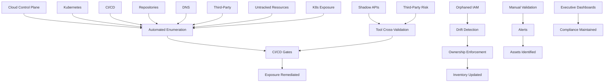

# Enterprise AppSec Playbook – Asset Inventory

## FAANG / Fortune-50 Scale Enterprise Asset Inventory Framework

> **Audience:** Senior / Staff / Principal Application Security Engineers
> **Usage:** Asset validation, onboarding gates, architecture reviews, governance enforcement, threat modeling
> **Scope:** Multi-cloud (AWS, GCP, Azure), Kubernetes, hybrid, serverless, CI/CD, regulated enterprise environments
> **Philosophy:** Inventory is a **foundational security control**. It must be continuously verified, enforced, and attack-tested.

---

# 1. Strategic Objective

This framework validates:

* Completeness of asset inventory
* Ownership accountability
* Internet exposure accuracy
* IAM-to-workload mapping
* Data classification integrity
* Drift detection capability
* Governance enforcement

### Inventory is valid only when:

* 100% of production assets are registered
* 100% of internet-facing assets are documented
* 100% IAM roles map to workloads
* Zero ownerless production assets exist
* Drift detection is automated and operational
* Governance enforcement blocks non-compliant deployments

Testing must occur only in authorized environments.

---

# 2. Hyperscale Enterprise Reality

Large enterprises operate:

* 100+ cloud accounts per provider
* 10k–100k compute workloads
* 1k+ repositories
* Multi-cloud, hybrid, serverless systems
* Federated business units
* Legacy infrastructure from acquisitions

Inventory must unify:

* Domains & DNS
* APIs
* Cloud compute
* IAM roles
* Kubernetes workloads
* CI/CD pipelines
* Repositories & containers
* Data stores
* Third-party integrations
* SaaS systems

> If enumeration takes more than 60 seconds, control is already degraded.

---

# 3. Core Testing Principles

1. Assume inventory is incomplete.
2. Independently enumerate infrastructure.
3. Cross-reference multiple sources of truth.
4. Validate ownership accountability.
5. Confirm exposure assumptions.
6. Test governance enforcement.
7. Simulate drift.
8. Verify detection.

> Inventory without validation is optimism.
> Inventory with enforcement is enterprise control.

---

# 4. Validation Phases + Integrated Attack Scenarios

---

## Phase 1 – Cloud Control Plane Reconciliation

### Goal

Ensure all cloud resources exist in central inventory.

### AWS Enumeration

```bash
aws ec2 describe-instances --query 'Reservations[*].Instances[*].[InstanceId,State.Name,PublicIpAddress]' --output table
aws elbv2 describe-load-balancers
aws iam list-roles
aws lambda list-functions
aws s3api list-buckets
aws rds describe-db-instances
```

### GCP

```bash
gcloud compute instances list
gcloud iam service-accounts list
gcloud functions list
```

### Azure

```bash
az vm list
az functionapp list
az role assignment list
```

### Attack Scenario Alignment

**Scenario: Exposed Cloud Resource Outside Inventory**

* Cloud bucket not registered
* Default public permissions
* No owner
* No monitoring

**Impact**

* Data exfiltration
* Regulatory violation
* Incident response blind spot

**Mitigation**

* Automated cloud-native discovery
* Mandatory tagging enforcement
* Daily reconciliation

---

## Phase 2 – Kubernetes Enumeration

```bash
kubectl get svc -A
kubectl get ingress -A
kubectl get svc -A | grep NodePort
kubectl describe svc <service-name>
```

### Validate

* Namespace → environment mapping
* External IP documentation
* Owner assignment
* IAM mapping
* Approved ingress routes

### Attack Scenario

**Scenario: Internal Admin Service Exposed**

* Misconfigured ingress
* No auth
* Not tracked in inventory

**Impact**

* Administrative takeover
* Lateral movement

**Mitigation**

* Continuous ingress audit
* Service inventory mapping
* Zero-trust service authentication

---

## Phase 3 – DNS & External Attack Surface

```bash
dig company.com
host legacy.company.com
curl -I https://legacy.company.com
```

Authorized enumeration:

```bash
amass enum -d company.com
```

### Attack Scenario

**Scenario: Forgotten Subdomain Hosting Legacy App**

* DNS record still active
* No owner
* Unpatched system

**Impact**

* Initial foothold
* Credential harvesting
* Regulatory exposure

**Mitigation**

* Continuous DNS monitoring
* Decommission tracking
* Ownership enforcement

---

## Phase 4 – API Surface Validation

```bash
curl https://api.company.com/.well-known/openapi.json
curl https://api.company.com/v1/internal/debug
```

### Validate

* All APIs tied to CI/CD
* Authentication enforced
* Owner documented
* Business logic tracked

### Attack Scenario

**Scenario: Shadow API Endpoint**

* Debug endpoint deployed
* No authentication
* Not in inventory

**Impact**

* Data exposure
* Privilege escalation

**Mitigation**

* API inventory auto-generated from pipeline
* Block undocumented routes
* Auth-by-default enforcement

---

## Phase 5 – IAM Relationship Testing

```bash
aws iam list-roles
aws iam get-role --role-name <role-name>
```

### Validate

* Trust policy correctness
* Least privilege
* Role mapped to workload
* Cross-account trust documented
* Unused roles removed

### Attack Scenario

**Scenario: Orphaned IAM Role**

* Unused role with high privileges
* Still trusted by compute

**Impact**

* Privilege escalation
* Cross-account compromise

**Mitigation**

* IAM-to-workload mapping enforcement
* Unused role auto-deletion
* Privilege reduction scanning

---

## Phase 6 – Internal Service Validation

```bash
curl http://internal-service.local/admin/status
```

### Attack Scenario

**Scenario: Overlooked Internal Service**

* Implicit trust
* No authentication
* Not documented

**Impact**

* Lateral movement
* Blast radius expansion

**Mitigation**

* Internal service inventory
* mTLS or identity-based auth
* East-west traffic monitoring

---

## Phase 7 – Third-Party Integration Validation

```bash
grep -R "THIRD_PARTY_API_KEY" .
```

### Attack Scenario

**Scenario: Undocumented Third-Party Integration**

* Shared API keys
* No credential rotation
* No ownership

**Impact**

* Supply chain compromise
* Data leakage

**Mitigation**

* Third-party inventory registry
* Scoped credentials
* Access monitoring

---

# 5. Security Tool Cross-Validation

| Tool             | Purpose                     |
| ---------------- | --------------------------- |
| Rapid7 InsightVM | Untracked host detection    |
| CrowdStrike      | Endpoint reconciliation     |
| Snyk             | Source-to-container mapping |
| HackerOne        | Shadow asset intelligence   |
| Power BI         | Executive dashboards        |

### Example: Rapid7 API Reconciliation

```python
import requests

url = "https://yourcompany.rapid7.com/api/3/assets"
headers = {"X-Api-Key": "API_KEY"}

response = requests.get(url, headers=headers)
assets = response.json()["resources"]

for asset in assets:
    print(asset["ip"])
```

Cross-reference with internal inventory DB.

---

# 6. Automation-Based Reconciliation

### Detect Untracked Cloud Assets

```python
import boto3

ec2 = boto3.client("ec2")
instances = ec2.describe_instances()

cloud_ids = [i["InstanceId"] for r in instances["Reservations"] for i in r["Instances"]]
inventory_ids = ["i-123", "i-456"]

missing = set(cloud_ids) - set(inventory_ids)
for m in missing:
    print("Untracked:", m)
```

### Detect Ownerless Assets

```python
for asset in assets:
    if not asset["owner"]:
        print("Ownerless:", asset["asset_id"])
```

---

# 7. Drift Detection Testing

Simulate:

1. Deploy new resource
2. Validate CI/CD registration hook
3. Confirm inventory entry auto-created
4. Delete resource
5. Confirm removal detected

> **Detection latency >24h is unacceptable at enterprise scale.**

---

# 8. Governance Gate Testing

Onboarding must fail if:

* Asset not registered
* Owner missing
* IAM unmapped
* Public exposure undocumented
* Data classification undefined

Enforce in:

* CI/CD
* IaC workflows
* Cloud provisioning
* Change management

---

# 9. Master Asset Inventory Workflow + Attack Overlay



---

# 10. Red Flags Observed in Production

* Public load balancer without owner
* DNS resolving to unknown infrastructure
* Kubernetes service without ingress documentation
* Container without linked repository
* IAM role unused but privileged
* Repeated bug bounty reports referencing unknown API

---

# 11. Exit Criteria – FAANG / Fortune-50 Maturity

* 100% production assets registered
* 100% internet-facing assets documented
* 100% IAM roles mapped
* Zero ownerless production assets
* Automated reconciliation daily
* Drift detection operational
* Governance gates enforced

---

# 12. Strategic Outcome

A validated asset inventory:

* Reduces unknown attack surface
* Improves vulnerability signal accuracy
* Accelerates incident containment
* Prevents shadow infrastructure growth
* Enables enforceable governance
* Supports audit & regulatory assurance

---

> **Asset inventory at enterprise scale is not documentation.**
> **It is a continuously tested security control.**
